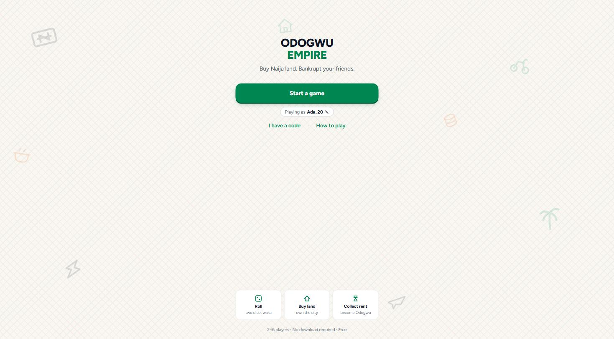
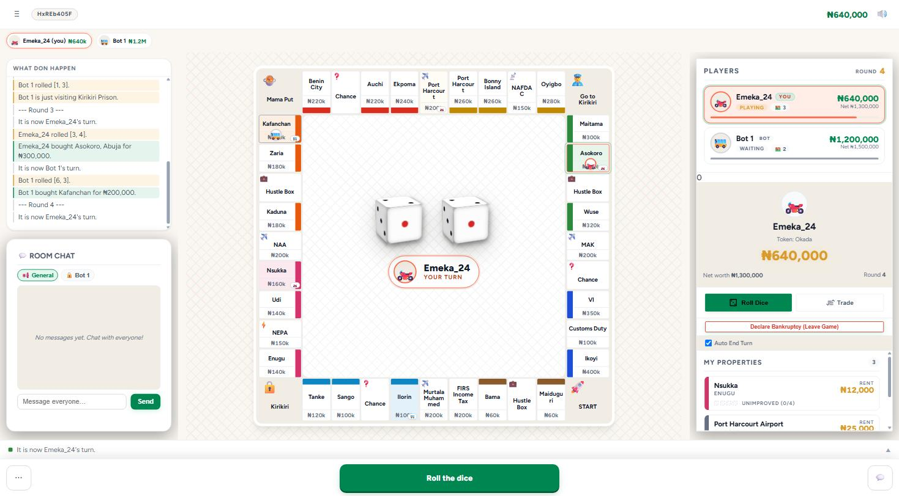
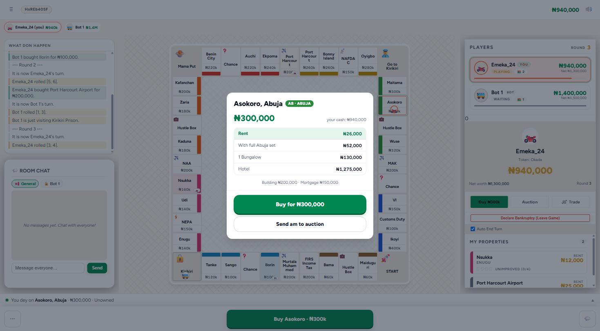

# Odogwu Empire

> **Buy the land. Become the Odogwu.**

A pan-Nigerian, real-time **online multiplayer** property-trading board game — built
on an authoritative server with a pure, fully-tested game engine. Buy properties from
Maiduguri to Ikoyi, charge rent in Naira, draw Pidgin-flavoured Chance / Hustle cards,
and bankrupt your rivals.

[](https://github.com/foodiezy/naija-poly/actions/workflows/ci.yml)
&nbsp;·&nbsp; **▶ Play the live demo: https://odogwu-empire-server.onrender.com**

> ⏳ The demo is hosted on a free tier that sleeps when idle — the first load after a
> while can take **~30–60s to wake up**, then it's instant. Open it in two tabs (or share
> the `?room=CODE` invite link) to play multiplayer.

---

|                                                                                     |                                                                                     |
| ----------------------------------------------------------------------------------- | ----------------------------------------------------------------------------------- |
|                                             |                                             |
| One promise, one button — and inline-SVG naira, okada and jollof drifting behind it | The board as a map: zone bands, ownership tints, one primary action under the thumb |



---

## Highlights

- **Authoritative server, not trust-the-client.** The server owns the true game state;
  clients send _intent_ (`ROLL`, `BUY`, `BID`…) and receive state updates. Money, rent,
  and ownership are **never** computed on the client — you can't cheat by tampering with
  the browser.
- **A pure, deterministic game engine.** All rules live in one place:
  `applyAction(state, playerId, action) => newState` — no mutation, no I/O, randomness
  only via an injected RNG. That purity is what makes the whole rulebook exhaustively
  testable headless.
- **205 passing tests**, including a full 2-player game simulated end-to-end
  (roll → rent → building → auctions → bankruptcy → winner). Strict TypeScript, no `any`.
- **Real-time multiplayer** over Colyseus/WebSockets: lobbies, invite links, AI bots,
  turn & auction timers, room-lock on start, and **60s reconnection grace** so a dropped
  player rejoins their game.
- **Built with a security mindset:** `NODE_ENV`-gated dev tooling (dev panel stripped from
  production builds), pinned CORS origins, per-client rate limiting, an uncircumventable
  **server-side chat profanity filter**, and **redacted state sync** (the card deck order
  is never sent to clients, so it can't be read ahead).
- **Data-driven board.** Layout, prices, rent tables, and card decks are plain data in
  `src/data/board.ts` — you retheme (new cities, a whole new edition) by editing data, not
  logic.

## Architecture

An **authoritative server** holds the single source of truth for every game. Clients are
thin: they render synced state and emit intents. The rules are a **pure reducer** —
`applyAction(state, playerId, action) => newState` — with all randomness injected, so every
edge case (full-group rent doubling, even-building, auctions on declined buys, multi-asset
trades, mortgage interest, cascading bankruptcy) is unit-tested deterministically _before_
any UI exists. The Colyseus server just validates an intent and calls the engine; the React
client just renders and sends intents. Because board content is data, the game is a
retheme-able platform rather than a one-off.

```
Client (React)  ──intent──▶  Colyseus server  ──▶  pure engine  ──newState──▶  broadcast
  renders state              validates + routes     applies rules              to clients
  (computes nothing            (no game logic)       (no I/O, injected RNG)
   authoritative)
```

## Tech stack

TypeScript (strict) · Colyseus + `@colyseus/schema` (authoritative multiplayer) ·
Express 5 · React 18 + Framer Motion · Vite 5 · Vitest. Deploys as a single Node web
service on Render (Express serves the built client and the WebSocket server same-origin).

**No third-party requests.** No web fonts, no CDN, no image hosts, no analytics or
tracking SDKs — the font is self-hosted, every illustration is inline SVG, and the board
is drawn entirely in CSS. A full page load plus opening a property deed makes 84 requests,
all to the app's own origin.

## Project structure

```
src/
  data/     board.ts        # board layout, prices, rent tables, card decks (incl. Chaos deck)
            profanity.ts     # server-side chat filter word list
            tokens.ts        # player tokens
  engine/   types.ts         # GameState, Player, Action, Card discriminated unions
            engine.ts        # the pure reducer: createGame + applyAction — all game rules
            ai.ts            # bot decision logic
            queries.ts       # derived read helpers (net worth, holdings…)
  server/   GameRoom.ts      # Colyseus room: validates intent, calls engine, syncs state
            index.ts         # Express + Colyseus bootstrap; serves the built client
  client/   App.tsx, components/, hooks/  # React UI: board, deeds, trading, chat, lobby
```

## Quickstart

```bash
npm install            # installs deps and builds the client (postinstall)

npm run dev:server     # Colyseus + Express on the API port
npm run dev:client     # Vite dev server for the UI

npm test               # run the vitest suite (205 tests)
npm run verify         # formatting + types + tokens + tests + production build
npm run test:bot        # real-server bot smoke test (server must be running)
npm run typecheck      # strict tsc --noEmit
npm run build          # production client build
```

## Design system

The UI was rebuilt in 2026 from a dark, desktop-first layout into a light,
**mobile-first** one — a 360px Android phone on metered data is the target, not a
1440px monitor. Full write-up: **[docs/redesign.md](docs/redesign.md)**.

- **Every colour is a token.** `src/client/tokens.css` is the single source of truth;
  components reference `var(--pri)`, `var(--zone-kwara-bar)` and so on, never a literal.
  A **CI gate** (`npm run check:colors`) fails the build if a hex or `rgb()` sneaks back
  into a component — which is exactly how the theme rotted the first time.
- **One contextual action.** `lib/primaryAction.ts` is a pure, unit-tested function
  deciding the single most important thing you can do right now (roll → buy → end turn →
  waiting). The action bar renders its answer; nothing else competes with it.
- **One decision at a time.** Buy, auction, chaos, debt rescue and incoming trade all
  route through a queue (`lib/sheetQueue.ts`), so a second decision waits its turn behind
  a "1 waiting" chip instead of stacking modals.
- **The board is a map.** Under 600px, tile names and prices come off — a zone band, an
  ownership tint and the owner's token say it at a glance, and the ticker names the tile
  you're standing on.

## Testing

The engine is designed to be tested without a server or a browser. Every rule that clones
commonly get wrong has focused coverage, and `playground.test.ts` drives a complete game to
a winner from a fixed seed — so the full rulebook is exercised deterministically on every
run. CI (`.github/workflows/ci.yml`) checks formatting, types and design tokens, runs the
suite, builds the production client, then starts the real multiplayer server and proves a
bot can join and complete a turn.

## Deploy

One Render web service: the same Node process serves the built Vite client as static files
**and** hosts the Colyseus WebSocket server, so client and server share an origin.
`NODE_ENV=production` disables all dev tooling; set `ALLOWED_ORIGINS` if the client is ever
served from a different origin.

Full settings, the SIGTERM drain, and the reason the build tools live in `dependencies`:
**[DEPLOY.md](DEPLOY.md)**.

## Working with Claude Code

This repo has a `CLAUDE.md` that Claude Code reads automatically — it encodes the
architecture rules and the tricky edge cases, so an agent builds in the right shape. Read
it before large changes.
